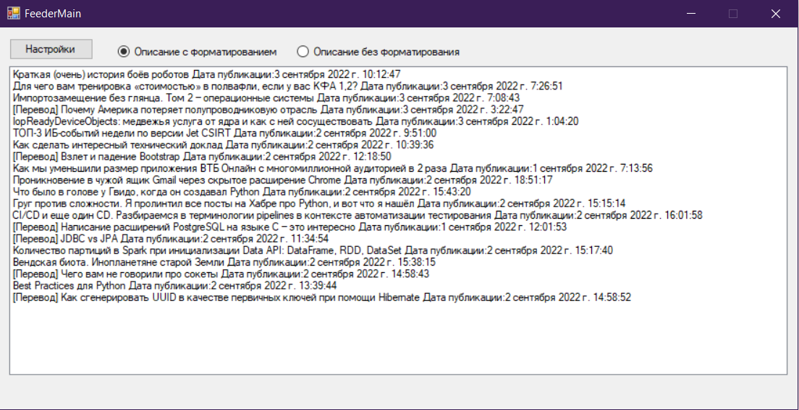
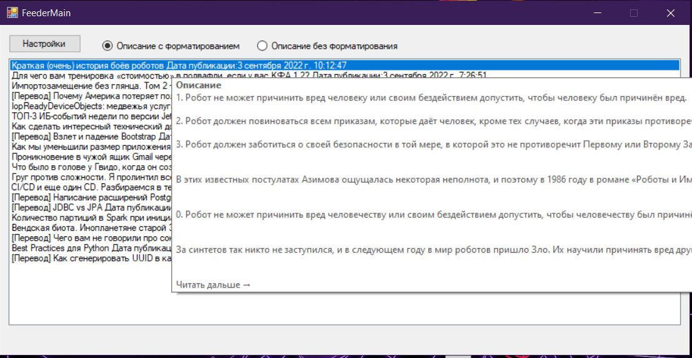
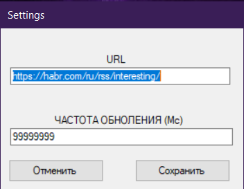

# RSS-Feed-Reader
## Графическое приложение для чтения RSS ленты с новостных сайтов.

Файл настроек в формате XML(config.xml) хранит в себе ссылку на ленту,которую обрабатывает фидер (url) и частоту обновления ленты(update_time) 
представленное в милисекундах.

>При запуске программы основное окно содержит список элементов ленты (название + дата). 
- При двойном нажатии на заголовой открывается браузер(или в уже открытом браузере ссылка). 
- Описание статьи выводится при наведении мышки на элемент.Имеется возможность смотреть форматированное и неформатированное описание.
 - Имеется возможность изменить ленту и частоту обновления в меню настроек.Опции в меню настроек валидируются.

 ## Внешний вид
 

  
     <strong>Основное окнов с данными</strong>

 

  
   <strong>Описание при наведении на элемент</strong>

 

  
 <strong>Форма настроек </strong>

